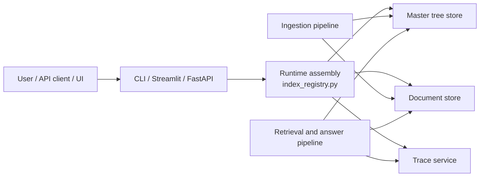
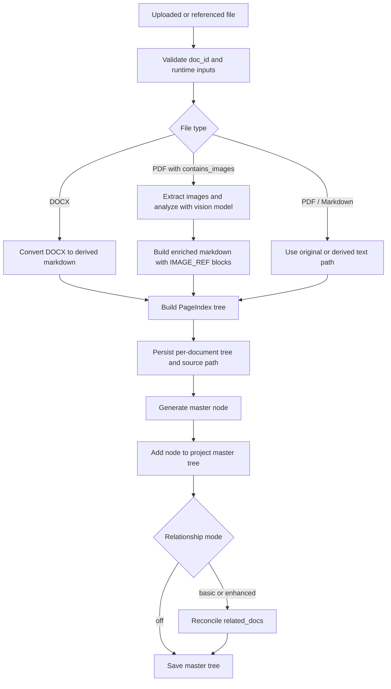
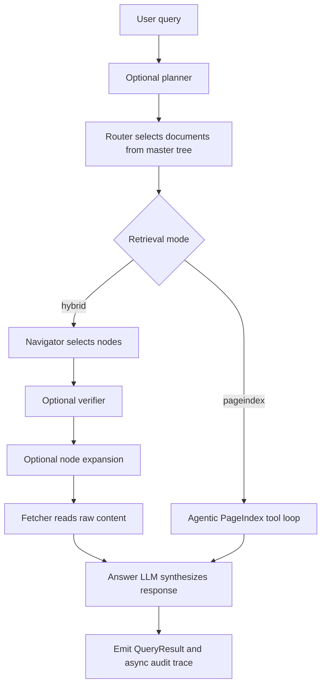

# Architecture Map

This document describes the base architecture of the repository, the major module boundaries, and the flows that connect them.

## What The System Is

Hybrid Approach is a document-ingestion and question-answering system built around PageIndex-style document trees plus a project-level routing layer.

The codebase actually contains two related systems:

- The main runtime, which ingests documents into project-scoped indexes under `data/indexes/` and answers questions through the CLI, Streamlit app, or FastAPI adapter.
- The experiments harness, which registers corpora, builds isolated artifact variants, runs controlled comparisons, and writes reports under `experiments/artifacts/`.

## Top-Level Module Map

| Area | Primary files | Responsibility |
| --- | --- | --- |
| Runtime foundation | `index_registry.py`, `utils.py`, `model_registry.py` | Runtime assembly, project/model resolution, env-driven config, provider compatibility |
| Ingestion | `ingestion/` | Convert source documents into PageIndex trees and master-tree routing nodes |
| Routing metadata | `master_tree/` | Store document summaries, top sections, routing facets, and related-doc links |
| Persistence | `storage/` | Save per-document trees, derived markdown, sources, and local images |
| Retrieval | `retrieval/` | Router, navigator, verifier, fetcher, advanced retrieval overlays, and PageIndex tool loop |
| Tracing | `traces/` | Audit traces, metrics, trace stats, and post-hoc analysis |
| Interfaces | `cli.py`, `app.py`, `api/` | Human and programmatic entrypoints |
| React UI | `frontend/` | Thin frontend over the FastAPI adapter |
| Experiments | `experiments/`, `experiments_app.py` | Isolated corpora, builds, comparison runs, reports, and evaluation |
| Vendor dependency | `PageIndex/` | Upstream PageIndex code loaded lazily during ingestion |

## High-Level Runtime Diagram

## Main Ingestion Flow

## Main Query Flow

## Artifact Taxonomy

There are two different artifact systems in the repository.

### Main runtime artifacts

- Namespace: `data/indexes/{project}/`
- Primary artifact family: `pageindex_tree`
- Core files:
  - `master_tree.json`
  - `doc_trees/{doc_id}_tree.json`
  - `derived_markdown/{doc_id}.md`
  - `images/{doc_id}/...`
  - `doc_sources.json`
  - `index_meta.json`

### Experiments artifacts

- Namespace: `experiments/artifacts/`
- Artifact families:
  - `rag_chunks`
  - `rag_vector`
  - `pageindex_tree`
- Comparison runs and reports are stored separately from the main app.

## The Important Distinctions

### Project vs model

- `project` selects the index namespace and therefore the visible document set.
- `model` is a runtime parameter used for LLM calls.
- Switching models does not create a new main-app index directory.

### Build presets vs retrieval profiles

- Build presets decide what artifacts are created.
- Retrieval profiles decide how queries use those artifacts.
- This matters most in the experiments harness, where `pageindex_*` build presets all create `pageindex_tree`, but `hybrid`, `pageindex`, `hybrid_advanced`, and `pageindex_advanced` change query behavior only.

### `hybrid` vs `pageindex`

- `hybrid` is the deterministic staged pipeline: route, navigate, verify, fetch, answer.
- `pageindex` is the more agentic runtime: route into docs, then let the model inspect document structure and node content through tool calls.

### Advanced retrieval

Advanced retrieval is a policy overlay, not a storage format.

It can add:

- query planning
- adaptive routing width
- node-neighborhood expansion

It does not add new persisted artifacts in the main runtime or the experiments harness.

### Related-document metadata

`related_docs` is maintained at ingestion time.

- `off` keeps the original generated links with no reconciliation.
- `basic` deterministically cleans and symmetrizes links.
- `enhanced` computes a bounded candidate shortlist, asks an LLM to refine, then runs basic reconciliation.

Query-time graph traversal over `related_docs` is explicitly noted as future work and is not implemented as a first-class runtime feature yet.

### Image-enriched PDFs

There is now a distinct PDF ingestion path when `contains_images=True`:

- images are extracted from the PDF
- each image is analyzed with a vision-capable model
- the analysis is injected back into a derived markdown file as structured `IMAGE_REF` blocks
- retrieval can then surface those references and the Streamlit UI can render the linked images

This is not yet exposed by the CLI, FastAPI ingestion contract, or React ingestion form.

## Repository Layout

| Path | Role |
| --- | --- |
| `app.py` | Main Streamlit UI |
| `cli.py` | Click-based command-line interface |
| `api/` | FastAPI adapter and request contracts |
| `frontend/` | Vite/React/TypeScript frontend |
| `ingestion/` | Preprocessing, PageIndex calls, image enrichment |
| `retrieval/` | Query routing, navigation, verification, fetching, answer orchestration |
| `master_tree/` | Master-node schema, store, and relationship logic |
| `storage/` | Document storage backends |
| `traces/` | Trace schema, persistence, and analysis |
| `experiments/` | Isolated builds, profiles, runs, reports, and evals |
| `tests/` | Pytest suite documenting intended behavior |

## Current Architectural Frictions

- Image-aware PDF ingestion assumes local-store image helpers and is not yet abstracted into the storage interface, so that path is not backend-neutral today.
- The Streamlit UI exposes features that the FastAPI adapter and React frontend do not yet surface, especially `contains_images` and retrieved image rendering.
- The React frontend intentionally remains a thin adapter and still lacks streaming answers and ingestion progress.
- The experiments harness reuses core retrieval logic, but the PageIndex experiment profile is retrieval-only there so the shared answer layer remains aligned across variants.
