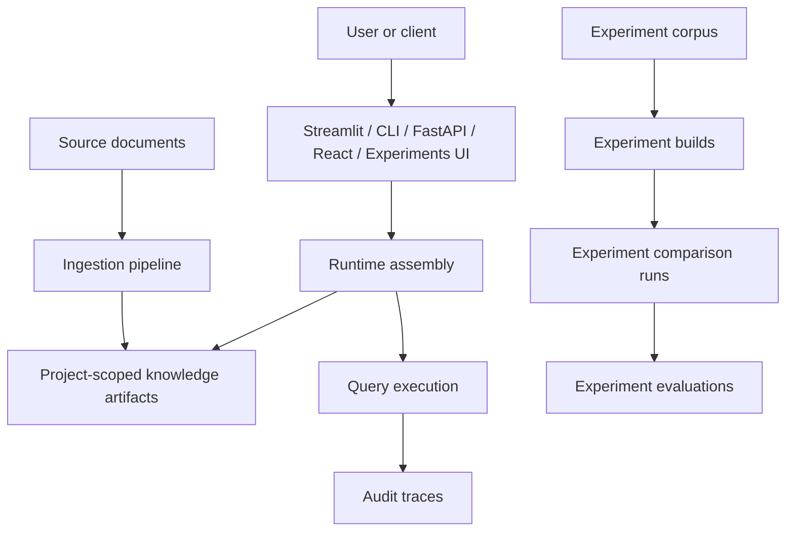
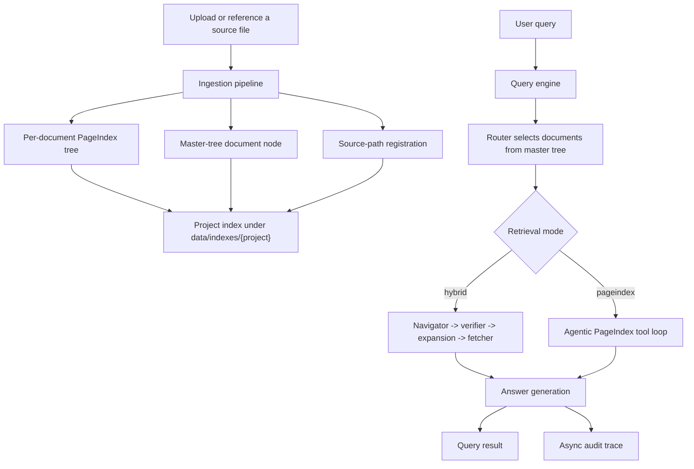
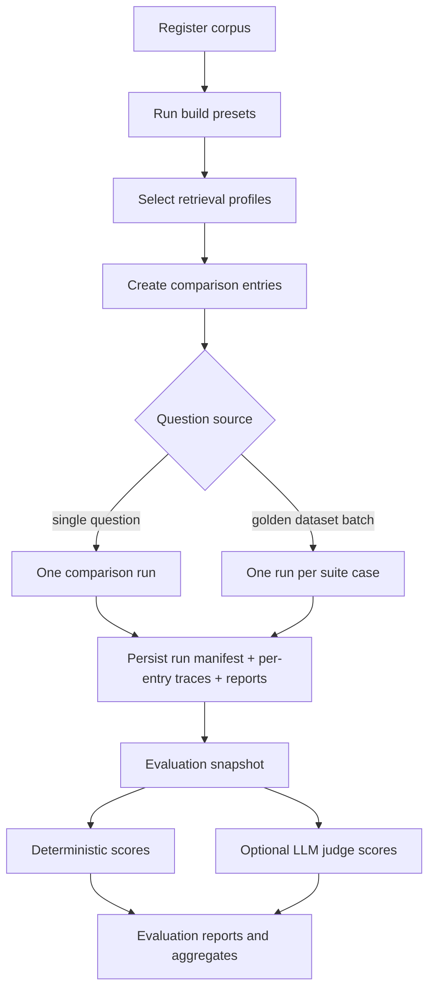

# Architecture Map

This document is the high-level map of the repository. It explains what the system is, how the major subsystems fit together, which artifact families exist, and which execution paths are available today.

## What This Repository Actually Contains

The repository contains two connected but distinct systems.

### 1. The main runtime

This is the operational document QA system exposed through:

- `app.py` for the main Streamlit UI
- `cli.py` for local command-line use
- `api/app.py` for the FastAPI adapter
- `frontend/` for the React client that talks to FastAPI

The main runtime persists project-scoped knowledge under `data/indexes/{project}/`.

### 2. The experiments harness

This is a separate lab environment exposed through:

- `experiments/` for corpus, build, run, report, and evaluation logic
- `experiments_app.py` for the experiments Streamlit UI

The experiments harness persists its own isolated state under `experiments/artifacts/`.

That isolation is architectural, not cosmetic. The experiments system is designed to compare variants without contaminating the main runtime’s active knowledge base.

## The System In One Sentence

Hybrid Approach ingests documents into PageIndex-style per-document trees plus a project-level master tree, then answers questions through either a deterministic staged retrieval pipeline or a more agentic PageIndex tool loop.

## The Four Main Planes

You can understand the repository by splitting it into four planes.

| Plane | Main code | What it owns |
| --- | --- | --- |
| Runtime plane | `index_registry.py`, `utils.py`, `model_registry.py` | project/model resolution, environment config, shared client setup, storage factory wiring |
| Knowledge plane | `ingestion/`, `master_tree/`, `storage/` | document preprocessing, PageIndex trees, master nodes, source-path registration, relationship maintenance |
| Query plane | `retrieval/`, `traces/` | routing, navigation, fetching, answering, tracing, post-hoc analysis |
| Evaluation plane | `experiments/`, `experiments_app.py` | corpora, isolated builds, comparison runs, reports, golden datasets, evaluations |

## Top-Level Flow



## Main Runtime Flow



## Experiments Flow



## The Most Important Architectural Distinctions

These distinctions explain most of the confusion people have when reading the code for the first time.

### Project vs model

| Axis | Meaning |
| --- | --- |
| `project` | selects the knowledge base and therefore the visible documents |
| `model` | selects the LLM/deployment used for runtime calls |

Changing the model does not move you to a different index directory. Changing the project does.

### Build preset vs retrieval profile

| Axis | Meaning |
| --- | --- |
| build preset | determines what artifacts are created and persisted |
| retrieval profile | determines how a query uses those artifacts |

This distinction matters mostly in the experiments harness.

Examples:

- `pageindex_base`, `pageindex_related_basic`, and `pageindex_related_enhanced` are different build presets that all still create `pageindex_tree` artifacts.
- `hybrid`, `pageindex`, `hybrid_advanced`, and `pageindex_advanced` are retrieval profiles that operate over those artifacts in different ways.

### Hybrid vs PageIndex mode

| Mode | What changes |
| --- | --- |
| `hybrid` | fixed staged retrieval path: route, navigate, verify, expand, fetch, answer |
| `pageindex` | router still selects docs, but the model then uses tools to inspect selected docs iteratively |

Both operate over the same main-runtime PageIndex artifacts.

### Base vs advanced retrieval

| Axis | What changes |
| --- | --- |
| base profile | use fixed query-time widths and no advanced planner overlay |
| advanced profile | optionally plan the query, adapt retrieval width, and in hybrid mode expand nearby nodes |

Advanced retrieval does not create a new tree format. It changes runtime policy only.

### Main runtime vs experiments

| System | Persistence root | Primary purpose |
| --- | --- | --- |
| main runtime | `data/` | answer real questions against the active project index |
| experiments | `experiments/artifacts/` | compare artifact families and retrieval strategies under controlled conditions |

## Artifact Families

There are three named artifact families in the codebase.

| Artifact family | Created by | Used by |
| --- | --- | --- |
| `pageindex_tree` | main ingestion pipeline and PageIndex experiment builds | hybrid retrieval, PageIndex retrieval |
| `rag_chunks` | `rag_standard` experiment builds | lexical chunk retrieval baseline |
| `rag_vector` | `rag_vector` experiment builds | local embedding retrieval, optional lexical fusion, optional reranking |

## Main Runtime Artifact Layout

```text
data/
  indexes/
    {project}/
      master_tree.json
      index_meta.json
      doc_sources.json
      doc_trees/{doc_id}_tree.json
      derived_markdown/{doc_id}.md
      images/{doc_id}/...
  uploads/
  traces/{project}/
  model_registry.json
```

## Experiments Artifact Layout

```text
experiments/artifacts/
  corpora/{corpus_id}/
  builds/{build_id}/
  runs/{run_id}/
  reports/{run_id}/
  evals/runs/{eval_run_id}/
  evals/suites/{suite_id}.json
```

## Capability Map By Interface

This is one of the most important current-state tables in the repo.

| Capability | Main Streamlit | CLI | FastAPI | React | Experiments UI |
| --- | --- | --- | --- | --- | --- |
| create/switch project | yes | yes | yes | yes | n/a |
| ingest PDF/MD/DOCX | yes | yes | yes | yes | corpus upload only |
| image-aware PDF ingestion | yes | no | no | no | no |
| browse PageIndex tree | yes | indirect | yes | yes | yes, via build artifacts |
| run hybrid queries | yes | yes | yes | yes | yes |
| run PageIndex agentic queries | yes | yes | yes | yes | yes |
| advanced retrieval toggles | yes | yes | yes | yes | yes |
| trace browsing | yes | yes | yes | yes | run/eval traces only |
| post-hoc trace analysis | yes | yes | yes | yes | n/a |
| corpus/build/run evaluation lab | no | no | no | no | yes |

## What A Query Can Actually Do

At query time, the system can currently take these major paths.

### Hybrid path

Use when you want bounded, structured retrieval with strong traceability.

Possible internal branches:

1. optional planner
2. strict router
3. broadened router fallback if strict routing returns nothing
4. navigator per selected doc
5. top-section fallback if navigator returns nothing for a doc
6. optional verifier
7. optional node-neighborhood expansion
8. fetch raw text under budget
9. answer from retrieved context

### PageIndex path

Use when you want deeper, more exploratory document inspection.

Possible internal branches:

1. optional planner for routing width
2. strict router
3. broadened router fallback
4. agentic tool loop over selected docs
5. stop either because the model is satisfied, the tool budget is exhausted, or the content budget is exhausted

## What Ingestion Can Actually Do

At ingestion time, the system can currently take these major paths.

### Standard path

- validate input
- optionally preprocess DOCX to markdown
- run PageIndex
- save tree
- generate master node
- optionally reconcile `related_docs`

### Image-aware PDF path

- validate input
- extract PDF images
- analyze images with a vision-capable model
- weave analysis back into enriched markdown using `IMAGE_REF` blocks
- run PageIndex on enriched markdown instead of the original PDF
- save tree, image files, source-path metadata, and master node

## Current Frictions And Mismatches

These are not hypothetical. They are current code-level realities.

### Interface parity is incomplete

- The main Streamlit app exposes image-aware ingestion.
- The CLI, FastAPI ingestion contract, and React ingestion form do not.

### Some UI copy is ahead of backend behavior

- The React Inspect page says project deletion removes traces.
- `delete_project()` only deletes project index artifacts, not trace files.

### The experiments harness intentionally reuses core logic but changes some semantics

- In the main runtime, PageIndex mode can answer directly from the agentic loop.
- In the experiments harness, PageIndex retrieval is used as a retrieval adapter and the final answer still goes through the shared answer layer so variant comparisons stay aligned.

### Relationship maintenance is ingestion-time only today

`related_docs` is built and reconciled at ingestion time, but there is not yet a first-class query-time graph traversal feature that actively walks those relationships.

### PageIndex experiment builds are expensive by design

If you run multiple `pageindex_*` build presets on the same corpus, the harness ingests every document once per preset. That is why the experiments UI can appear to “ingest the same files again”: it is building multiple isolated artifact variants.

## Recommended Reading Order After This

1. `modules/runtime-foundation.md`
2. `modules/ingestion-pipeline.md`
3. `modules/retrieval-and-answering.md`
4. `modules/interfaces-and-operations.md`
5. `modules/experiments-harness.md`
