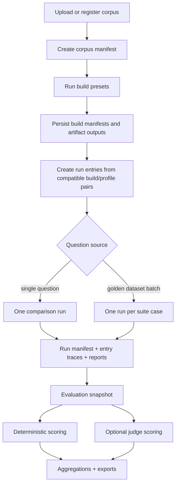

# Experiments Harness

Primary code:

- `experiments/models.py`
- `experiments/layout.py`
- `experiments/corpora.py`
- `experiments/builds/`
- `experiments/profiles.py`
- `experiments/workflows.py`
- `experiments/retrieval/`
- `experiments/answering.py`
- `experiments/runs/registry.py`
- `experiments/reports.py`
- `experiments/evals/`
- `experiments_app.py`

## Purpose

The experiments harness is the controlled evaluation lab for this repository.

It exists so you can:

- copy and normalize a corpus once
- build multiple artifact variants from that same corpus
- run compatible retrieval profiles over those artifacts
- keep answer generation aligned across variants
- compare outputs, latency, token use, and operator judgments
- run golden-dataset evaluations without changing the live main-runtime index

This is a separate system from the main app, even though it reuses many of the same ingestion and retrieval modules internally.

## Artifact Root

Everything lives under:

```text
experiments/artifacts/
```

Resolved subdirectories:

- `corpora/`
- `builds/`
- `runs/`
- `reports/`
- `evals/runs/`
- `evals/suites/`

## Main Mental Model

The experiments harness has five layers:

1. corpus normalization
2. artifact builds
3. retrieval-profile execution
4. comparison runs and reports
5. evaluation snapshots

Each layer persists a stable manifest so later layers can be rerun or inspected without reconstructing earlier state from memory.

## End-To-End Flow



## Corpus Layer

`experiments/corpora.py` normalizes source documents into reusable corpus manifests.

Each corpus stores:

- stable `corpus_id`
- display name
- description
- copied source documents under `source_docs/`
- per-document metadata such as size, extension, and SHA-256

This matters because builds should depend on an immutable corpus snapshot, not arbitrary local file paths that may change later.

## Build Layer

Artifact builds are executed by `ArtifactBuildRunner`.

The runner:

1. resolves a deterministic `build_id`
2. creates an isolated build directory
3. writes a running manifest
4. dispatches to the correct build adapter
5. persists outputs, document artifacts, and metrics

### Deterministic build IDs

`build_id` is derived from:

- corpus ID
- build label
- a stable fingerprint of the build config

That is why matching builds can be reused instead of recreated when `force=False`.

## Build Presets

The experiments UI exposes these presets through `experiments/workflows.py`.

| Build preset | Artifact family | What it creates |
| --- | --- | --- |
| `rag_standard` | `rag_chunks` | flat lexical chunks |
| `rag_vector` | `rag_vector` | flat chunks plus local embeddings and optional lexical corpus |
| `pageindex_base` | `pageindex_tree` | PageIndex trees with relationship maintenance off |
| `pageindex_related_basic` | `pageindex_tree` | PageIndex trees with deterministic relationship maintenance |
| `pageindex_related_enhanced` | `pageindex_tree` | PageIndex trees with enhanced relationship maintenance |

### Important nuance about the PageIndex presets

All `pageindex_*` build presets still create the same artifact family: `pageindex_tree`.

What changes between them is build-time relationship maintenance policy, not the basic tree format.

### Why ingestion seems to repeat in experiments

When you run multiple `pageindex_*` presets for the same corpus, the PageIndex build adapter loops over every document once per preset.

So if you have:

- 6 documents
- 3 PageIndex presets

you get 18 ingestion passes.

That is current experiments behavior, not a duplicate-upload bug.

## PageIndex Build Adapter

The PageIndex build adapter intentionally reuses `ingest_document_with_trace()`.

For each corpus document it:

1. runs the shared ingestion pipeline into the isolated build directory
2. saves the per-document tree
3. saves the build-local master tree
4. writes an ingestion trace JSON

This keeps PageIndex experiment builds close to the main-runtime ingestion semantics.

## Retrieval Profiles

Retrieval profiles are query-time behaviors, not build-time artifacts.

Current profile catalog:

| Retrieval profile | Artifact family | Behavior |
| --- | --- | --- |
| `rag_standard` | `rag_chunks` | lexical chunk retrieval baseline |
| `rag_vector` | `rag_vector` | dense local semantic retrieval |
| `rag_vector_rrf` | `rag_vector` | dense + lexical reciprocal-rank fusion |
| `rag_vector_rerank` | `rag_vector` | dense + lexical fusion + local reranker |
| `hybrid` | `pageindex_tree` | deterministic staged PageIndex retrieval |
| `hybrid_advanced` | `pageindex_tree` | hybrid plus advanced query-time planning/widening/expansion |
| `pageindex` | `pageindex_tree` | agentic PageIndex retrieval |
| `pageindex_advanced` | `pageindex_tree` | PageIndex retrieval plus advanced routing/planning policy |

### What “advanced does not create new artifacts” means here

`hybrid_advanced` and `pageindex_advanced` still run on the same `pageindex_tree` build artifacts as their base versions.

They do not trigger:

- a different build adapter
- a different artifact family
- a separate ingestion pass

They change only query-time policy, mainly:

- planning
- adaptive width
- caps
- in the hybrid case, structural node expansion

## Shared Answer Layer

The experiments harness uses a shared answer profile:

- `aligned_default`

This is a deliberate design choice. It reduces prompt drift between retrieval variants so the comparison remains more about retrieval behavior and less about answer prompt differences.

### Important difference from the main runtime

In the main runtime, PageIndex mode can answer directly from its agentic loop.

In the experiments harness, the PageIndex retrieval adapter can be run in retrieval-only mode and then the shared answer layer produces the final answer. That keeps comparisons across retrieval variants more aligned.

## Comparison Runs

Comparison runs are executed by `ExperimentRunRunner`.

A run contains:

- one query
- one question type
- one model
- a set of requested entries
- one result summary per entry
- per-entry trace files
- generated reports

### Run entries

Each run entry is one compatible combination of:

- build
- retrieval profile
- answer profile

The system creates entries only when artifact families are compatible.

### Compatibility rules

Examples:

- `pageindex_tree` builds can pair with `hybrid` and `pageindex` profiles
- `rag_vector` builds can pair with vector profiles
- mismatched pairs are skipped rather than force-run

## Run Progress And Resume Behavior

The run registry now persists in-flight status more explicitly.

It can:

- mark entries `running` before execution
- persist manifests mid-run
- emit progress events for run start, entry start, entry completion, and run completion
- resume unfinished runs by re-executing only `pending` or `running` entries

This is why the experiments UI can now show entry-level progress instead of one opaque spinner.

## Golden Datasets And Suites

Golden datasets are modeled as persisted `EvaluationSuite` objects under:

```text
experiments/artifacts/evals/suites/{suite_id}.json
```

### Import paths

The suite store can import:

- CSV
- JSON

CSV is the recommended path for most manual golden-dataset editing workflows.

### Current UI flow

In the experiments Streamlit app, suite import and suite execution are separate actions.

The current operator path is:

1. import or persist the suite in the `Evaluation` tab
2. switch to `Compare`
3. choose `Golden dataset batch`
4. run the next batch of suite cases

That split is intentional in the current UI, but it is easy to miss if you expect upload and execution to live in one place.

### Case model

Each suite case can include:

- `case_id`
- `question`
- `question_type`
- optional ground-truth answer
- optional required facts
- optional forbidden claims
- optional gold sources
- optional tags, scenario, persona, notes

## Golden-Dataset Batch Execution

This is the newer suite-driven run flow.

When the experiments Compare tab uses `Golden dataset batch`:

1. select a persisted suite
2. choose the next batch size
3. select build/profile combinations
4. execute the next N suite cases

Each suite case becomes its own comparison run.

That run is linked back to the suite through:

- `suite_id`
- `case_id`

### Important nuance about batching

Suite batching is currently sequential across cases.

So:

- batch size `5` means “run the next 5 cases one after another”
- entry concurrency still applies inside each individual run

This is why batch progress can sit on “Case 1/5” for a while even though work is still happening.

## Evaluation Snapshots

Evaluations are executed by `EvaluationRunner`.

They operate over existing comparison runs, not raw corpora or builds.

### Evaluation modes

1. deterministic evaluation
2. optional judge-backed evaluation

### Suite selection behavior

Evaluation can use:

- an explicitly selected persisted suite
- an attached suite inferred from the selected runs
- an ad hoc suite derived from selected runs

Important new behavior:

if all selected runs are linked to the same golden dataset, the Evaluation tab now auto-detects and preselects that suite.

The Compare flow also stores the most recent suite-batch run IDs in session state so the Evaluation tab can start from those newly created suite-linked runs without requiring manual reselection every time.

## Deterministic Evaluation

The deterministic phase scores entries using:

- latency
- token usage
- LLM call count
- retrieval width
- routing broadening
- truncation
- budget exhaustion

It produces technical, efficiency, reliability, and retrieval-discipline scores.

## Judge-Backed Evaluation

The judge phase can score:

- groundedness
- completeness
- directness
- actionability
- business fit
- abstention quality
- gold alignment
- required fact coverage
- contradiction vs gold answer
- source matching

It uses ground-truth and gold-source fields when those exist, and falls back gracefully when they do not.

## Evaluation Progress

The evaluation system now emits live progress events for:

- evaluation start
- deterministic scoring start/completion per entry
- judge scoring start/completion per entry
- evaluation completion

The Evaluation tab can therefore show:

- how many entries have been scored so far
- which case/label just finished
- partial completed-analysis tables while the rest of the evaluation is still running

### Partial-manifest handling

The evaluation dashboard now tolerates `running` and partially aggregated evaluation snapshots.

That matters because long evaluations can be interrupted, and a partially written manifest should still render as partial state rather than crashing the dashboard when some aggregate tables are still empty.

### Why evaluations can still take a long time

Evaluation time scales with entries, not just runs.

If you select 15 runs and each run has multiple entries, the judge phase may involve dozens of LLM judge calls. That is why long wall-clock evaluation times can still be normal even with the new progress UI.

## Reports

The harness writes multiple report artifacts:

- run-level reports
- aggregate run reports
- evaluation summaries
- HTML and Markdown overviews
- CSV exports

These are stored under `experiments/artifacts/reports/` and `experiments/artifacts/evals/runs/`.

## Flow Guide

### Flow: compare one question across variants

1. register corpus
2. build artifact presets
3. choose compatible retrieval profiles
4. generate run entries
5. execute one comparison query
6. inspect entry metrics, answers, and traces

### Flow: run a golden dataset

1. import a suite in the Evaluation tab
2. switch Compare to `Golden dataset batch`
3. choose suite and batch size
4. run the next batch
5. inspect generated per-case runs

### Flow: evaluate suite-linked runs

1. select the suite-linked runs
2. allow auto-detected attached suite to preselect
3. run evaluation
4. inspect deterministic and optional judge-backed scores
5. export reports

### Flow: resume or rerun

1. choose an existing run
2. resume unfinished entries or rerun failed entries
3. generate a new derived run manifest and reports

## What Is Possible In This Module

This harness can currently:

- normalize corpora
- build flat RAG, vector RAG, and PageIndex artifact families
- run hybrid and agentic PageIndex retrieval over isolated builds
- attach golden datasets to runs
- execute suite batches
- auto-match suite-linked runs during evaluation
- emit live run and evaluation progress
- generate reports and exports

## Current Constraints

- PageIndex experiment builds repeat ingestion once per selected preset.
- Suite batches are sequential across cases, not parallel.
- Judge scoring is still effectively sequential and can be slow on large selections.
- The experiments harness is intentionally isolated from the live app index, so artifacts must be inspected under `experiments/artifacts/`, not under `data/indexes/`.
