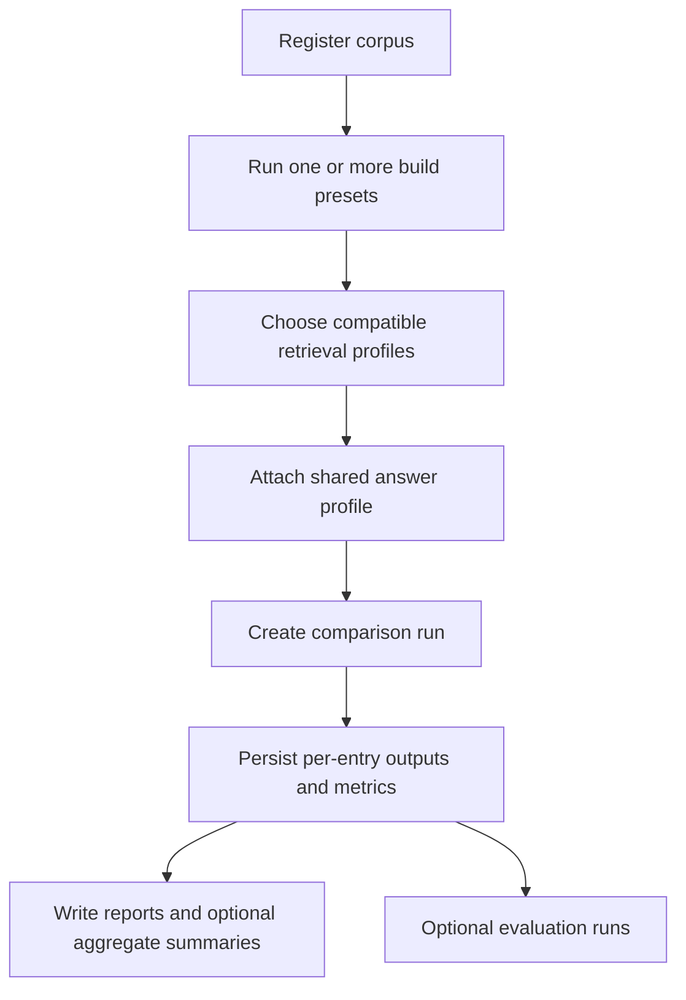

# Experiments Harness

Primary code:

- `experiments/README.md`
- `experiments/workflows.py`
- `experiments/models.py`
- `experiments/layout.py`
- `experiments/corpora.py`
- `experiments/builds/`
- `experiments/retrieval/`
- `experiments/answering.py`
- `experiments/runs/registry.py`
- `experiments/reports.py`
- `experiments/evals/`
- `experiments_app.py`

## Purpose

The experiments harness is a separate lab environment for controlled comparisons.

It exists so the team can:

- register corpora once
- build multiple artifact variants from the same corpus
- attach compatible retrieval profiles
- keep answer generation aligned across variants
- compare outputs, latency, token usage, and review outcomes

It is intentionally isolated from the main runtime.

## Artifact Root

Everything lives under:

```text
experiments/artifacts/
```

Subdirectories:

- `corpora/`
- `builds/`
- `runs/`
- `reports/`
- `evals/`

## End-To-End Flow



## Corpus Layer

`experiments/corpora.py` normalizes source documents into reusable corpus manifests.

A corpus stores:

- copied source documents
- stable doc metadata
- hashes and normalized paths

This lets multiple builds reuse the same exact source snapshot.

## Build Presets

`experiments/workflows.py` exposes the build preset catalog.

Current preset IDs:

- `rag_standard`
- `rag_vector`
- `pageindex_base`
- `pageindex_related_basic`
- `pageindex_related_enhanced`

### Build preset behavior

| Build preset | Artifact family | What it creates |
| --- | --- | --- |
| `rag_standard` | `rag_chunks` | Flat lexical chunks only |
| `rag_vector` | `rag_vector` | Flat chunks plus local embeddings and optional ANN/lexical helpers |
| `pageindex_base` | `pageindex_tree` | PageIndex trees with no relationship reconciliation |
| `pageindex_related_basic` | `pageindex_tree` | Same tree artifacts, basic relationship maintenance |
| `pageindex_related_enhanced` | `pageindex_tree` | Same tree artifacts, enhanced relationship maintenance |

The important point is that the `pageindex_*` family varies ingestion-time relationship maintenance, not the core artifact family.

## Retrieval Profiles

`experiments/workflows.py` and `experiments/profiles.py` define the retrieval profiles.

Current profile IDs:

- `rag_standard`
- `rag_vector`
- `rag_vector_rrf`
- `rag_vector_rerank`
- `hybrid`
- `hybrid_advanced`
- `pageindex`
- `pageindex_advanced`

### Profile behavior

| Retrieval profile | Artifact family | Behavior |
| --- | --- | --- |
| `rag_standard` | `rag_chunks` | Lexical chunk retrieval baseline |
| `rag_vector` | `rag_vector` | Dense local semantic retrieval |
| `rag_vector_rrf` | `rag_vector` | Dense plus lexical fusion |
| `rag_vector_rerank` | `rag_vector` | Dense retrieval plus reranking |
| `hybrid` | `pageindex_tree` | Deterministic PageIndex retrieval path |
| `hybrid_advanced` | `pageindex_tree` | Same artifacts, advanced query-time planning and widening |
| `pageindex` | `pageindex_tree` | Agentic PageIndex retrieval path |
| `pageindex_advanced` | `pageindex_tree` | Agentic path plus advanced query-time policy overlay |

### What "advanced does not create new artifacts" means

`hybrid_advanced` and `pageindex_advanced` still operate on the same `pageindex_tree` builds as their base variants.

They do not trigger:

- a different ingestion pipeline
- a different artifact family
- a new corpus build

They only change query-time behavior:

- planning
- adaptive width
- related caps and node/document limits

## Shared Answer Layer

The experiments harness keeps answer generation aligned with a shared answer profile:

- `aligned_default`

This matters because it keeps build and retrieval comparisons focused on retrieval differences rather than prompt drift.

### Important difference from the main app

In the experiments harness, the PageIndex retrieval profile is generally used as a retrieval adapter, and the final answer still goes through the shared answer layer.

In the main app runtime, PageIndex mode answers directly from its own agentic loop.

## Reports And Runs

The run layer persists:

- requested entries
- per-entry outputs
- metrics
- annotations
- winners
- rerun and resume state

`experiments/reports.py` writes:

- JSON
- CSV
- Markdown
- HTML

There is also aggregate reporting by question type.

## Evaluations

The `experiments/evals/` layer adds a more formal evaluation path over existing runs and suites.

It is separate from basic manual comparison so the repo can support both:

- human-reviewed comparisons
- structured evaluation snapshots

## Optional Dependencies

The lexical and PageIndex experiment paths work with the core requirements.

The vector-RAG path needs `requirements-experiments.txt`, which adds packages such as:

- `numpy`
- `sentence-transformers`
- `rank-bm25`
- optional `hnswlib`

If `hnswlib` is absent, vector retrieval still works via brute-force cosine search.

## Experiments UI

`experiments_app.py` is the separate Streamlit surface for the harness.

It supports:

- corpus creation
- build execution
- comparison creation
- run inspection
- report inspection
- aggregate reporting

It uses its own custom visual theme and should not be confused with the main app runtime UI.

## Why The Harness Matters Architecturally

The harness makes the build-time and query-time axes explicit.

That is why statements like these are both true:

- `pageindex_*` build presets create `pageindex_tree` artifacts
- advanced profiles do not create new artifacts

They refer to different layers:

- build presets decide what gets stored
- retrieval profiles decide how stored artifacts are queried
