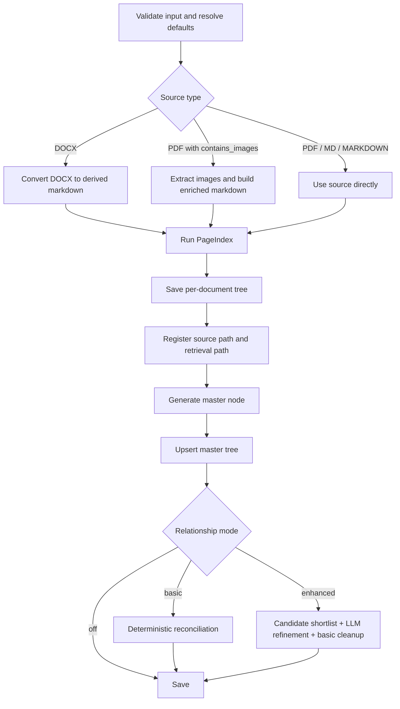

# Ingestion Pipeline

Primary code:

- `ingestion/ingest.py`
- `ingestion/docx_converter.py`
- `ingestion/master_node_gen.py`
- `ingestion/image_extractor.py`
- `ingestion/image_analyzer.py`
- `ingestion/pdf_enricher.py`
- `master_tree/relationships.py`
- `storage/store.py`

## Purpose

The ingestion pipeline turns one source document into the set of artifacts the query system can use later.

For the main runtime, one successful ingestion can produce:

- a per-document PageIndex tree
- a master-tree document node
- a source-path registration entry
- optional derived markdown
- optional stored image files
- an ingestion trace with step-level detail

In the experiments harness, the same ingestion logic is reused inside the PageIndex build adapter so experiment builds stay behaviorally aligned with the main runtime.

## Supported Inputs

The accepted file extensions are:

- `.pdf`
- `.md`
- `.markdown`
- `.docx`

That support is validated in `ingestion/ingest.py`.

## Main Entry Points

There are two async entry points:

- `ingest_document()`
- `ingest_document_with_trace()`

Both share the same implementation. The only difference is the return shape:

- `ingest_document()` returns only the `MasterNode`
- `ingest_document_with_trace()` returns `IngestionResult`, which includes the master node, the per-document tree, and the ingestion trace

## High-Level Flow

## Step-By-Step Execution

### 1. Validate input and resolve runtime defaults

The ingestion implementation resolves:

- `model`
- `top_sections_target`
- `relationship_mode`
- supported extension
- absolute source path

The trace records these resolved values up front so operators can later see which defaults were actually applied.

### 2. Preprocess the source when necessary

This step is branch-dependent.

#### Markdown input

Plain markdown is already in the format the markdown PageIndex entrypoint can consume, so it usually flows straight through.

#### DOCX input

DOCX is converted to derived markdown with `docx_to_markdown()`.

That conversion is important for two reasons:

1. PageIndex’s markdown entrypoint is used rather than trying to parse DOCX directly.
2. Later query-time fetches can read the derived markdown rather than repeatedly re-converting the DOCX.

The derived markdown path becomes the retrieval path, while the original DOCX path is still preserved as the source path.

#### Standard PDF input

If `contains_images=False`, the PDF goes through the normal PageIndex PDF path.

#### Image-aware PDF input

If `contains_images=True` and the file is a PDF, ingestion takes a different branch before PageIndex runs.

That branch:

1. extracts content-bearing images from the PDF
2. analyzes those images with a vision-capable model
3. stores the original image files
4. rebuilds the document as enriched markdown with `IMAGE_REF` blocks
5. sends that enriched markdown into PageIndex

This is the only path that makes image content available later during retrieval.

## PageIndex Boundary

PageIndex is loaded lazily, not imported eagerly at module load time.

That loader:

- searches for the local PageIndex checkout
- patches PageIndex helper functions to use this repo’s client setup
- patches PageIndex progress hooks so the app can show ingestion progress
- supports both PDF and markdown entrypoints

The practical effect is that the repo keeps PageIndex integration logic on its side of the boundary rather than editing vendor code directly.

## PageIndex Execution Paths

### PDF path

PDF ingestion goes through `page_index_main()`.

### Markdown path

Markdown and markdown-derived sources go through `md_to_tree()`.

The code adapts one shared config object into the slightly different entrypoint signatures for those two upstream functions.

## Persisted Outputs

After PageIndex returns a tree, ingestion persists:

- the tree JSON under `doc_trees/`
- the source-path registration in `doc_sources.json`
- any derived markdown under `derived_markdown/`
- any extracted images under `images/{doc_id}/`

The stored source-path record distinguishes:

- `source_path`
- `retrieval_path`

That distinction is subtle but critical. Query-time fetchers read the retrieval path, not always the original file.

Examples:

- DOCX source, markdown retrieval path
- PDF source, enriched markdown retrieval path when image analysis is enabled

## Master Node Generation

Once the per-document tree exists, ingestion calls `generate_master_node()`.

This step summarizes the document into the cross-document routing format used by the master tree.

The generated node includes:

- document summary
- key topics
- relevance hints
- selected top sections
- optional routing facets
- initial `related_docs`

That master node is the router-facing abstraction of the document. Query routing quality depends heavily on the quality of this step.

## Relationship Maintenance

After the new master node is added, ingestion may run relationship reconciliation.

### `off`

Do not reconcile anything after master-node generation.

### `basic`

Run deterministic cleanup and symmetry over the local neighborhood of the new document.

### `enhanced`

First shortlist candidate neighbors from deterministic metadata overlap, then ask an LLM to refine the new document’s related set, then run basic cleanup for symmetry and bounds.

The relationship result is embedded into the ingestion trace when reconciliation runs.

## Image-Aware PDF Branch In Detail

This is the newest and most nuanced ingestion path in the repo.

### What qualifies

- file must be a PDF
- caller must explicitly pass `contains_images=True`

### What `doc_type` means in this path

`doc_type` is not a parser selector. It is free-form semantic context passed into the image-analysis prompt. Values such as `technical_spec`, `playbook`, or `architecture_overview` are all acceptable.

### What gets extracted

The image extraction module preserves:

- image ID
- page number
- MIME type
- width and height

Small, non-meaningful images are filtered out before analysis.

### What gets analyzed

The analyzer asks for structured image understanding such as:

- image type
- plain-language description
- extracted text when present
- content explanation

### What gets persisted

- original image bytes on disk
- enriched markdown containing `IMAGE_REF` blocks that point back to those images

### Why this matters later

At query time, retrieved context can include those `IMAGE_REF` blocks. The main Streamlit app can then render both the answer text and the linked image artifacts together.

## Progress And Trace Semantics

Ingestion emits both:

- structured progress events for live UI updates
- a durable step-by-step ingestion trace in the returned result

Progress events include milestones such as:

- ingestion step updates
- image analysis start
- PageIndex start
- master-node generation start
- ingestion complete

The trace captures the same run in a more durable debugging-oriented format.

## Flow Guide

### Flow: ingest a markdown file

1. validate extension
2. run PageIndex markdown ingestion
3. save tree and source path
4. generate master node
5. optionally reconcile relationships

### Flow: ingest a DOCX file

1. convert DOCX to markdown
2. save derived markdown
3. run PageIndex markdown ingestion on the derived file
4. register original source path and markdown retrieval path
5. generate master node and optionally reconcile relationships

### Flow: ingest a standard PDF

1. validate PDF
2. run PageIndex PDF ingestion
3. save tree and source path
4. generate master node and optionally reconcile relationships

### Flow: ingest an image-heavy PDF

1. extract images
2. analyze images
3. store images
4. build enriched markdown with `IMAGE_REF`
5. run PageIndex on enriched markdown
6. register original PDF as source path and enriched markdown as retrieval path
7. generate master node and optionally reconcile relationships

### Flow: run PageIndex builds in experiments

1. experiments build adapter loops over corpus documents
2. each document calls `ingest_document_with_trace()`
3. resulting trees, master tree, and ingestion traces are stored under the isolated build directory

This is why experiments PageIndex builds behave like repeated ingestion passes over the corpus.

## What Is Possible In This Module

This module can currently:

- ingest PDF, markdown, and DOCX inputs
- preserve source-vs-retrieval path distinctions
- build PageIndex trees lazily through the vendor boundary
- generate router-facing master nodes
- maintain `related_docs` deterministically or with a bounded LLM assist
- enrich PDFs with image analysis before indexing
- emit progress callbacks and rich traces

## Current Constraints

- Image-aware ingestion is PDF-only.
- The image-aware branch is surfaced in the main Streamlit app but not in the CLI, FastAPI ingestion contract, or React ingest form.
- The storage abstraction does not yet expose image helpers as backend-neutral interface methods.
- Experiments PageIndex presets currently re-run ingestion once per selected preset rather than reusing a shared base tree and re-materializing only relationship variants.
