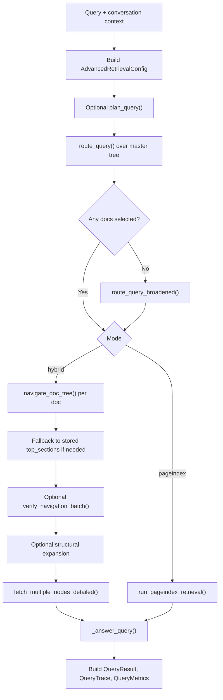

# Retrieval And Answering

Primary code:

- `retrieval/query_engine.py`
- `retrieval/router.py`
- `retrieval/navigator.py`
- `retrieval/verifier.py`
- `retrieval/fetcher.py`
- `retrieval/planner.py`
- `retrieval/pageindex_engine.py`

## Purpose

This layer turns a user query plus a project index into:

- routed documents
- selected node references
- fetched text context
- a final answer
- metrics and trace data

## Retrieval Modes

The main runtime supports two retrieval modes.

### `hybrid`

This is the deterministic staged pipeline:

1. optional planner
2. router
3. navigator
4. optional verifier
5. optional node expansion
6. fetcher
7. answer model

### `pageindex`

This mode keeps the same document router, but after routing it switches to an agentic tool-use loop over the selected documents.

The model can ask for:

- `get_document_structure(doc_id)`
- `get_node_content(doc_id, node_id)`

It explores the selected docs under explicit tool-call and content-token budgets, then answers directly.

## Query Flow In Detail

## Query Inputs

The orchestrator accepts:

- `user_query`
- `conversation_context`
- `max_docs`
- `model`
- `reasoning_effort`
- `advanced_retrieval`
- `retrieval_mode`
- optional answer token callback
- optional trace service

The query engine is async because it performs multiple model calls and async trace writes.

## Router

The router operates on the master-tree LLM context only.

It has two modes:

- strict routing
- broadened routing

Broadened routing is a fallback when strict routing returns no relevant docs. The answer prompt is then told that routing was broadened so the answer can communicate best-effort uncertainty.

## Planner And Advanced Retrieval

Advanced retrieval is controlled by `AdvancedRetrievalConfig`.

When enabled, it can apply three sub-features:

- planning
- adaptive width
- node expansion

### Planner

`retrieval/planner.py` classifies the query into types such as:

- fact lookup
- compare
- workflow or process
- policy or compliance
- troubleshooting
- architecture or design

The planner returns a `QueryPlan` that can recommend:

- `recommended_max_docs`
- `recommended_max_nodes`
- whether expansion is useful
- whether the query appears broad

### Adaptive width

Adaptive width converts planner recommendations into effective query-time widths while respecting caps from:

- `max_docs_cap`
- `max_nodes_cap`

### Node expansion

Node expansion adds bounded neighboring nodes around primary selections.

This exists only in the hybrid staged pipeline. It is not the same as related-document graph traversal.

## Navigator

The navigator works inside a selected document tree and chooses node IDs likely to answer the question.

Important properties:

- per-document operation
- summary-first selection
- bounded node count
- fallback to master-node `top_sections` when no strong navigation result is returned

## Verifier

The verifier is a best-effort self-correction pass.

It runs one batched LLM call per document and asks whether each candidate section likely addresses the query.

Failure behavior is intentionally conservative:

- if the verifier call fails, keep the original picks
- if it rejects every section in a document, keep the top original pick as a safety net

This keeps verification from causing total recall collapse.

## Fetcher

The fetcher loads raw text from the retrieval-time source path and extracts the selected node ranges under a token budget.

It preserves source metadata such as:

- `doc_id`
- `node_id`
- title
- page range

It also prefixes chunk text with parent section context when available so the answer model gets more local structure.

## Answer Synthesis

After retrieval, the final answer LLM is called with:

- a system prompt built from domain and routing context
- the combined retrieved context
- the user query and optional conversation history

The system prompt can also signal conditions like:

- truncated retrieval context
- broadened routing fallback

## PageIndex Agentic Engine

`retrieval/pageindex_engine.py` wraps the more agentic query path.

Current design:

- router still preselects the candidate docs
- agent can inspect doc structure and pull node content iteratively
- explicit budgets prevent unconstrained tool churn
- trace data records explored docs and budget exhaustion flags

Tracked PageIndex metrics in `QueryTrace`:

- tool calls made
- tool call budget
- content tokens used
- content token budget
- explored docs
- tool budget exhausted flag
- content budget exhausted flag

## Query Outputs

`QueryResult` includes:

- `answer`
- `selected_docs`
- `selected_nodes`
- `retrieved_context`
- `trace`
- `sources`
- `metrics`
- `image_refs`

### `image_refs`

This is new and comes from `ingestion/pdf_enricher.parse_image_refs()`.

If retrieved context contains `IMAGE_REF` blocks, the query engine surfaces them as structured metadata so the UI can render the referenced stored images.

## Failure And Degradation Behavior

The retrieval layer has several deliberate degradation paths:

- router broadening when strict routing is empty
- navigator fallback to stored `top_sections`
- verifier failure falling back to original navigation
- planner disabled or unavailable without changing base behavior
- PageIndex tool budgets capping exploration instead of allowing runaway loops

These are important to the system design because the repo prefers bounded incompleteness over hard failure in live query paths.

## Difference Between Main Runtime And Experiments

In the main runtime:

- `pageindex` answers directly from its agentic loop

In the experiments harness:

- PageIndex retrieval is typically used as a retrieval adapter
- the final answer still goes through the shared aligned answer layer for fairness across variants

That difference is intentional and is described further in the experiments documentation.
