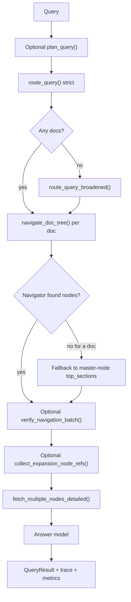
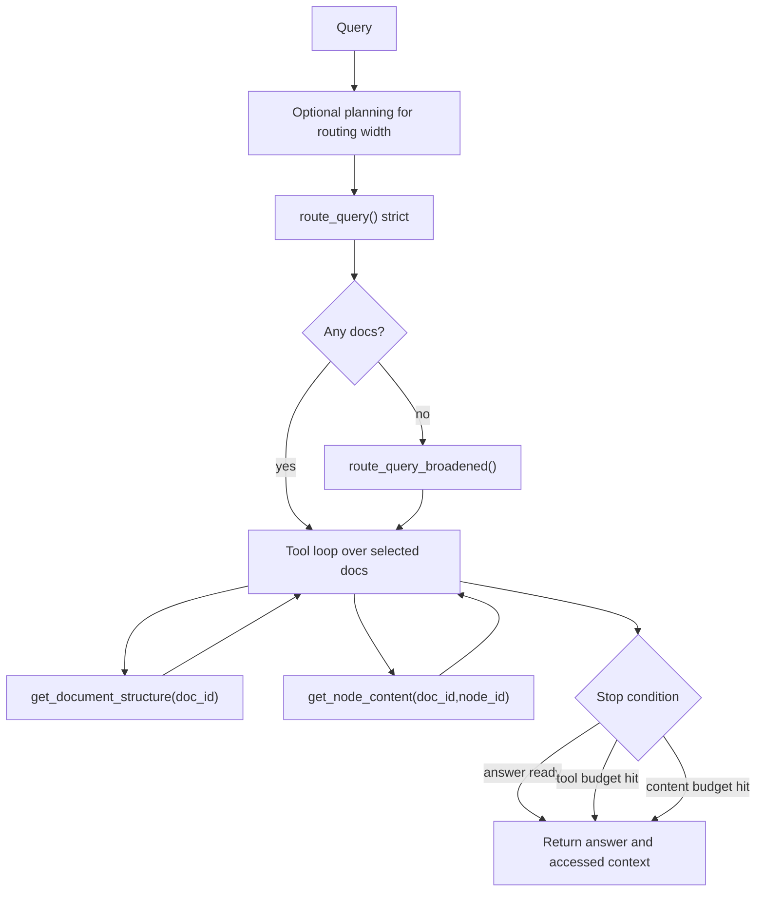

# Retrieval And Answering

Primary code:

- `retrieval/query_engine.py`
- `retrieval/router.py`
- `retrieval/navigator.py`
- `retrieval/verifier.py`
- `retrieval/fetcher.py`
- `retrieval/planner.py`
- `retrieval/pageindex_engine.py`
- `ingestion/pdf_enricher.py`

## Purpose

This layer turns a user query plus a project index into:

- selected documents
- selected sections or nodes
- fetched context
- a final answer
- source references
- metrics
- an audit trace

It is where the system’s “hybrid” and “pageindex” personalities diverge.

## The Two Main Retrieval Modes

### `hybrid`

The deterministic staged pipeline.

It uses a fixed sequence of components:

1. optional planner
2. document router
3. per-document navigator
4. optional verifier
5. optional structural expansion
6. fetcher
7. final answer generation

This path is easier to reason about and easier to trace.

### `pageindex`

The more agentic PageIndex loop.

It still starts with the same document router, but after routing it gives the model tools so it can inspect selected documents iteratively.

The model can call:

- `get_document_structure(doc_id)`
- `get_node_content(doc_id, node_id)`

This path is more exploratory and more variable in cost and latency.

## Query Engine Inputs

The main orchestrator accepts:

- `user_query`
- `master_tree_store`
- `storage`
- `model`
- `conversation_context`
- `max_docs`
- `reasoning_effort`
- `trace_service`
- `project`
- `advanced_retrieval`
- `retrieval_mode`
- optional token callback for streaming

The query engine is async because it may perform multiple model calls and writes traces asynchronously.

## Query Output Types

The main public return type is `QueryResult`.

It includes:

- `answer`
- `selected_docs`
- `selected_nodes`
- `retrieved_context`
- `trace`
- `sources`
- `metrics`
- `image_refs`

`image_refs` is especially important in the newer image-aware ingestion path. It is populated by parsing `IMAGE_REF` blocks found in retrieved context.

## Hybrid Flow In Detail

### Router

The router operates only over the master-tree context. It does not see full document trees.

There are two router variants:

- `route_query()` for strict routing
- `route_query_broadened()` for best-effort fallback when strict routing finds nothing

Broadened routing is important because it changes the epistemic status of the answer. The system can still answer, but it should answer as “best effort from tangentially related material.”

### Navigator

The navigator works within one selected document tree at a time.

It receives:

- the user query
- the flat readable representation of all nodes in that document
- conversation context
- reasoning effort
- a max node count

It returns `doc_id::node_id` refs, not raw content.

### Top-section fallback

If navigation returns nothing for a document, the system can fall back to the `top_sections` stored on that document’s master node.

This is important because it prevents total retrieval failure when the navigator is indecisive but the ingestion-time summarizer had already identified strong sections.

### Verifier

The verifier is a best-effort correction step. It asks the model whether candidate sections really address the query.

Important failure behavior:

- if the verifier call fails, keep the original picks
- if it rejects everything for a document, keep the first original pick as a safety net

That design prefers graceful degradation over empty retrieval.

### Expansion

Expansion adds bounded structural neighbors around the primary node selection.

It can include nearby nodes such as:

- siblings
- parent-adjacent context
- first child context

This is not graph traversal over `related_docs`. It is local structural expansion within the already selected document trees.

### Fetcher

The fetcher is the first stage that reads raw document content.

It resolves each node ref into:

- title
- page range
- extracted text
- estimated tokens
- truncation flags
- expansion provenance

It also optionally prepends parent-section context when a parent node has `prefix_summary`. This is a subtle but important feature because it prevents isolated child chunks from losing their framing.

## PageIndex Agentic Flow In Detail

### Tool set

The agent sees two tools only:

- document structure inspection
- node-content retrieval

This is deliberate. The system keeps the agent’s action space narrow and document-focused.

### Budgets

The PageIndex engine tracks:

- tool calls made
- tool call budget
- content tokens used
- content token budget
- explored docs
- budget exhaustion flags

These metrics are fed back into the `QueryTrace` so operators can see whether the agent was productive or simply ran out of budget.

### Main-runtime answer semantics

In the main runtime, PageIndex mode can answer directly from the agentic loop.

That is different from the experiments harness, where the PageIndex retrieval adapter can be used in retrieval-only mode and the shared answer layer then generates the final answer so comparisons stay aligned.

## Advanced Retrieval

Advanced retrieval is controlled by `AdvancedRetrievalConfig`.

It has:

- an overall `enabled` flag
- planning toggle
- adaptive-width toggle
- node-expansion toggle
- `max_docs_cap`
- `max_nodes_cap`

### Planning

The planner classifies the query and recommends retrieval width.

Typical planner outputs include:

- query type
- recommended max docs
- recommended max nodes
- whether node expansion is useful

### Adaptive width

Adaptive width turns the planner’s recommendations into the actual effective widths for the current query, but never beyond the configured caps.

### Important difference between hybrid and PageIndex advanced modes

- `hybrid_advanced` can use node expansion
- `pageindex_advanced` uses planning and adaptive document width, but its adapter explicitly disables node expansion because the PageIndex loop explores content through tools instead

This distinction is easy to miss and matters when comparing profiles.

## Source References

The query layer emits structured source references that include:

- `node_ref`
- `doc_id`
- section title
- page range

These are returned to callers and also used in experiment traces and evaluations.

## Image Reference Handling

When retrieved context contains `IMAGE_REF` blocks, the query engine parses them and exposes them in `QueryResult.image_refs`.

Current interface reality:

- the main Streamlit app can render those image refs inline with the answer
- the React frontend does not currently model or display them
- the API returns the full query payload, but the React type surface still lags this field

## Trace And Metrics Behavior

The query engine also builds:

- `QueryTrace`
- `QueryMetrics`

These capture:

- routed docs
- navigation choices
- fetched chunks
- truncation and budget info
- advanced-retrieval metadata
- PageIndex agentic exploration metrics
- latency and token usage

If a `TraceService` is provided, the engine writes an `AuditTrace` asynchronously after the answer is ready.

## Flow Guide

### Flow: direct fact lookup

Likely path:

1. strict routing finds one or two documents
2. navigator selects a small number of nodes
3. fetcher reads tight chunks
4. answer is fast and bounded

This is where `hybrid` usually shines.

### Flow: broad workflow question

Likely path:

1. planner recommends wider retrieval
2. adaptive width raises doc and node limits
3. hybrid may also use node expansion
4. answer trades latency for better completeness

### Flow: hard multi-document reasoning

Possible strategies:

- `hybrid_advanced` for bounded but wider retrieval
- `pageindex` or `pageindex_advanced` when you want iterative inspection over the selected docs

### Flow: no strong direct match

Likely path:

1. strict routing returns nothing
2. broadened router returns tangential docs
3. answer should be treated as best effort rather than authoritative

### Flow: image-backed answer

1. prior ingestion must have used the image-aware PDF branch
2. fetcher retrieves enriched markdown containing `IMAGE_REF`
3. query engine parses image refs
4. main Streamlit UI renders answer text and linked images together

## What Is Possible In This Module

This layer can currently:

- route queries at the document level
- navigate within document trees
- verify or widen navigation results
- fetch raw content across PDFs, markdown, and DOCX-derived content
- run an agentic tool loop over selected docs
- expose structured sources and metrics
- parse and surface image references from enriched retrieval context

## Current Constraints

- PageIndex traces do not expose the same section-level `sections_used` richness as hybrid traces.
- Advanced node expansion is a hybrid-only concept today.
- Broadened routing can preserve recall, but it weakens answer authority and must be interpreted that way.
- The React frontend still lags the backend on `image_refs`.
